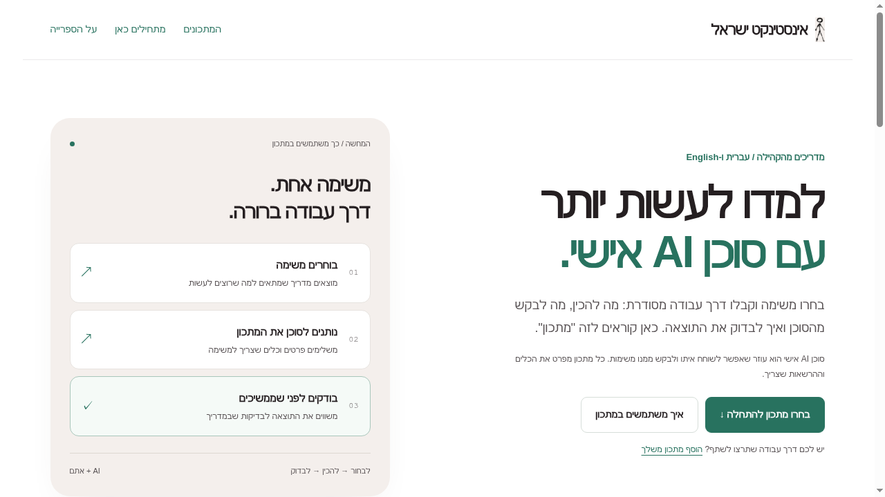

  
  <h1 dir="rtl">ספריית המתכונים לסוכן AI אישי</h1>
  
<b>משימה אחת. דרך עבודה ברורה.</b> מתכונים מלאים מהקהילה, בעברית ובאנגלית: מה להכין, מה לבקש מהסוכן ואיך לבדוק את התוצאה.

<b><a href="https://ofershap.github.io/agent-success-hub/">הספרייה</a> · <a href="https://ofershap.github.io/agent-success-hub/start.html">מתחילים כאן</a> · <a href="https://ofershap.github.io/agent-success-hub/submit.html">הוסף מתכון משלך</a> · <a href="https://chat.whatsapp.com/K4e3jxRerQs7QDAy9h8InB">הקהילה בוואטסאפ</a></b>

 

  

# בחרו משימה. תנו לסוכן את המתכון.

הספרייה אוספת דרכי עבודה מלאות עם סוכן AI אישי, מתוך שיחות בקהילת אינסטינקט ישראל. בכל מתכון: המטרה, מה להכין, שלבי העבודה, בדיקות ומה עדיין צריך לבדוק.

הספרייה מתאימה למי שכבר עובד עם סוכן AI ורוצה רעיונות למשימות חדשות, ולמי שמתחיל ורוצה לראות איך נראית בקשה מסודרת. ארבעת המתכונים פתוחים לקריאה בעברית ובאנגלית.

## איך משתמשים במתכון?

1. פתחו את [הספרייה](https://ofershap.github.io/agent-success-hub/) ובחרו משימה שקרובה למה שאתם רוצים לעשות.
2. קראו את התקציר ואת "לפני שמתחילים". הכינו את הפרטים וודאו שלסוכן שלכם יש הכלים המתאימים.
3. לחצו **"שלח לסוכן בוואטסאפ"** כדי לפתוח בקשה עם קישור למתכון, וקראו אותה לפני השליחה. אפשר גם **"העתק מתכון"** ולהדביק בשיחה עם הסוכן.
4. התאימו את הפרטים, הגדירו מה מותר לבצע ובדקו את התוצאה לפי הבדיקות במתכון.

חדשים כאן? [המדריך הקצר](https://ofershap.github.io/agent-success-hub/start.html) מראה את כל הדרך, מבחירת מתכון עד בדיקת התוצאה.

## איך מוסיפים מתכון משלכם?

הסוכן עזר לכם במשימה? שתפו את הדרך, כדי שגם אחרים יוכלו להתאים אותה לעצמם.

- כתבו את המטרה, מה צריך להכין, שלבי העבודה ואיך בדקתם.
- ציינו מה עבד ומה עדיין צריך לבדוק.
- ודאו שמותר לפרסם את התוכן, והסירו סודות, מידע על לקוחות ושיחות פרטיות.
- אשרו את הנוסח המלא לפני ההגשה, גם כשהסוכן עוזר לכתוב אותו.

מגישים דרך **"הוסף מתכון משלך"** ב[טופס האתר](https://ofershap.github.io/agent-success-hub/submit.html), בעברית או באנגלית, בלי חשבון GitHub:

**https://ofershap.github.io/agent-success-hub/submit.html**

למי שמעדיף, [הגשה דרך GitHub](https://github.com/ofershap/agent-success-hub/issues/new?template=story.yml) נשארת חלופה. שם ההגשה ובקשת השינוי (PR) גלויים לציבור מיד.

## מה קורה אחרי ההגשה?

ההגשות באתר נבדקות פעמיים ביום. לפני פרסום בודקים התאמה לספרייה, בהירות, פרטיות ובטיחות. מתכון מתפרסם אחרי סינון ואישור, והתוכן נעשה ציבורי עם הפרסום. הודעת הצלחה בטופס מאשרת קליטה, לא פרסום.

כל מתכון שומר את גבולות הבדיקה של התורם. בדיקת טקסט או תרגום אינה בדיקת ביצוע מלאה של המשימה. הודעות לאנשים, פרסום, גישה לחשבונות ותשלום דורשים אישור נפרד.

## אינסטינקט והקהילה

הספרייה נבנתה בעקבות שיחות בקהילה. אינסטינקט (Instinct) הוא סוכן AI אישי; בקהילה קוראים לו "איציק". אפשר להיעזר במתכונים גם עם סוכנים אחרים שיש להם הכלים המתאימים.

- [ספריית המתכונים](https://ofershap.github.io/agent-success-hub/)
- [טופס הגשת מתכון](https://ofershap.github.io/agent-success-hub/submit.html)
- [קהילת אינסטינקט ישראל - מדברים עם בוטים - סוכן AI לכל אחד](https://chat.whatsapp.com/K4e3jxRerQs7QDAy9h8InB)
- [הצטרפות לאינסטינקט דרך קישור הספרייה](https://app.instinct.com/invite?t=agent-success-hub)
- [האתר הרשמי של Instinct](https://www.instinct.com)

## למי שתורם דרך הקוד

[הנחיות לתורמים ולסוכנים](AGENTS.md) · [פרטיות ובטיחות](SECURITY.md)

המתכונים נמצאים בתיקיית `entries`, והתרגומים המלאים בתיקיית `translations`. תרומת תוכן עוברת בדיקה ואישור לפני פרסום. הרצת מתכון והרשאות לביצוע הן החלטות נפרדות מההגשה.

 

## English summary

A community recipe library for tasks with a personal AI agent, from the Israeli Instinct community. Four recipes are available in Hebrew and English, with preparation, steps, checks and contributor-reported limits.

Choose a recipe on the [website](https://ofershap.github.io/agent-success-hub/), use **"Send to your agent on WhatsApp"** or **"Copy recipe"**, add your details and permissions, then check the result.

Use **"Add your own recipe"** to submit through the [website form](https://ofershap.github.io/agent-success-hub/submit.html). Hebrew and English submissions are welcome, with no GitHub account needed. [GitHub submission](https://github.com/ofershap/agent-success-hub/issues/new?template=story.yml) is a secondary option and is public immediately.

Website submissions are screened twice daily and published after approval. A successful submission confirms receipt, not publication. Contributor reports and translations do not establish independent execution testing.

